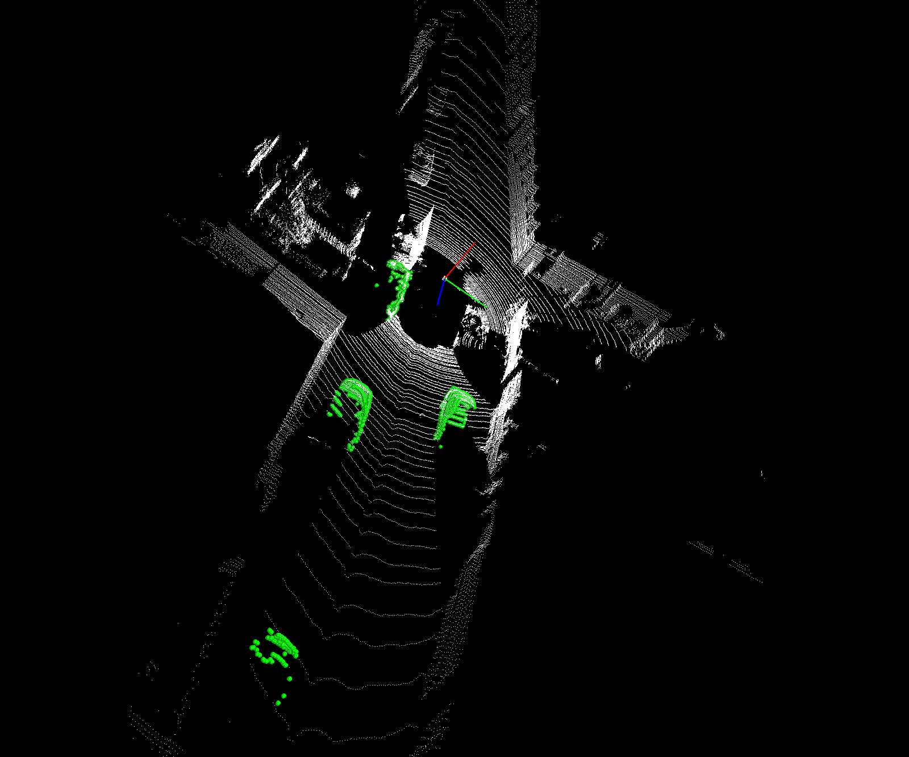

# 保存bbox内的点云，移除其余点云

以kitti数据集为例

- 1. 读取数据 `[lidar,label,calib,image]`
- 2. 利用`label` 和`calib`的，计算lidar坐标系下bbox的corner点

```
           |       |                                |-------------[#obj,#surfaces,#point_in_surfaces, 3]
           |       |                                            |---------[N,6,4,3]
           |       |---投影矩阵:[R0_rect],[Tr_velo_to_cam]
           |
           |------annos[`dimension`],annos[`location`]
```

- 3. 利用`判断lidar数据中的每个点是否位于BBOX每个面的法向量以内` `Ax+By+Cz ? d` 的方法求出位于BBOX内的点云


## usage
```bash
python script.py
```


