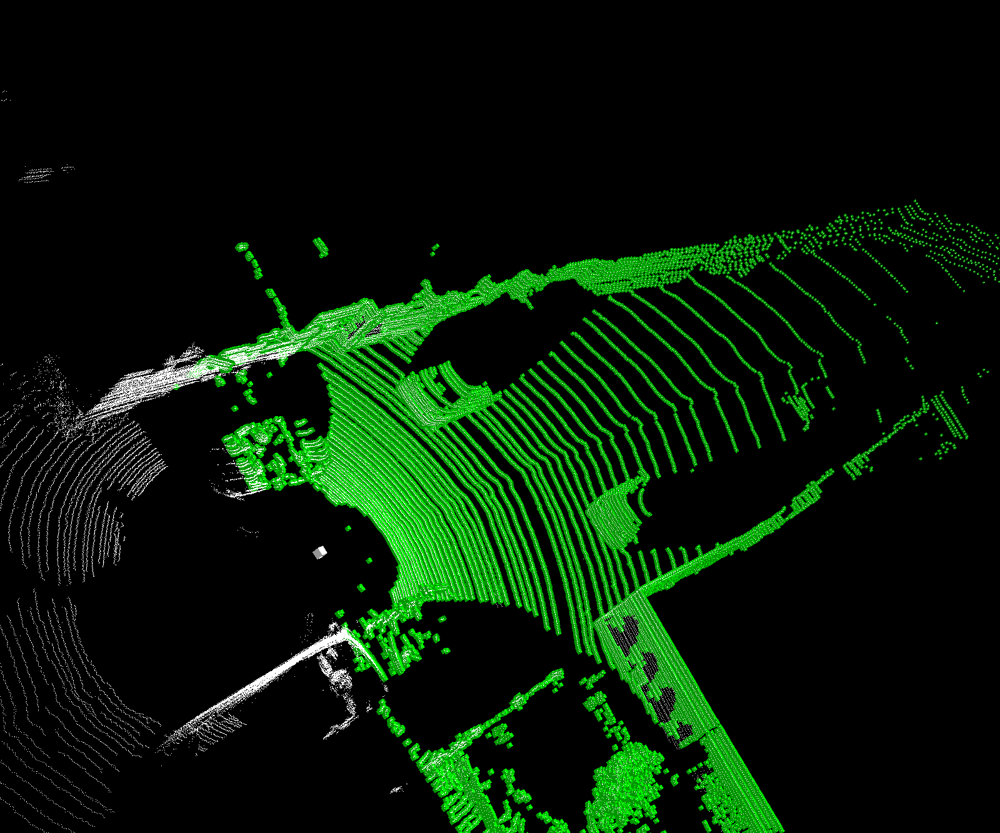

# 将原始点云转换为体素点云


## 依赖环境
 - `python3.6+` `numba` `numpy` ,不追求速度，`numba`也可以省了

## 所需参数

```python 
    points #(N,4)
    point_cloud_range = [0, -40, -3, 70.4, 40, 3]
    voxel_size = [0.16, 0.16, 2]
    max_num_points = 35
    max_voxels = 12000
```

## 算法思路

 - 1. 首先通过`pc_range`和`voxel_size`计算空间的网格尺寸
```python
	grid_size =  (point_cloud_range[3:] - point_cloud_range[:3]) / voxel_size
	grid_size = np.round(grid_size, 0, grid_size).astype(np.int32)	
``` 
 - 2. 变量初始化
```python
    num_points_per_voxel = np.zeros(shape=(max_voxels, ), dtype=np.int32) #[20000,0]
    coor_to_voxelidx = -np.ones(shape=grid_size, dtype=np.int32)   #[400 , 390 , 2]
    voxels = np.zeros(shape=(max_voxels, max_points, points.shape[-1]), dtype=points.dtype)  #[20000,35,4]
    coors = np.zeros(shape=(max_voxels, 3), dtype=np.int32)   #[20000,3]
    coor = np.zeros(shape=(3, ), dtype=np.int32) #value = [0,0,0]
    voxel_num = 0
    failed = False
```

 - 3. 进入loop，一次遍历搞定所有

```python
    for i in range(N):  # ====>1.遍历点云
        failed = False
        for j in range(ndim): #====>2.每个维度
            c = np.floor((points[i, j] - coors_range[j]) / voxel_size[j])    # ====>3.计算该点的门牌号
            if c < 0 or c >= grid_size[j]:           #====>4.判断是否在所设定的空间内
                failed = True
                break
            coor[j] = c
        if failed:
            continue   #++++小技巧 学到了
        voxelidx = coor_to_voxelidx[coor[0], coor[1], coor[2]]  #5.voxelidx = voxel_num or -1 ,-1表示第一次check到该点的门牌号
        if voxelidx == -1:
            voxelidx = voxel_num
            if voxel_num >= max_voxels:
                break
            voxel_num += 1
            coor_to_voxelidx[coor[0], coor[1], coor[2]] = voxelidx    #===>6.更新coor2voxelidx
            coors[voxelidx] = coor    #==>7.将门牌号与对应的点个数传递给coors
        num = num_points_per_voxel[voxelidx]
        if num < max_points:
            voxels[voxelidx, num] = points[i]   # =====>8.关键步骤，把点传递给对应的门派ID，以及NUM次序
            num_points_per_voxel[voxelidx] += 1  # ====>9.传递一次，+1
    return voxel_num
```


## Usage

```bash
python script.py
```




## performance

```
# frame speed: 2.462148666381836 ms/id
# frame speed: 4.048585891723633 ms/id
# frame speed: 3.7550926208496094 ms/id
# frame speed: 2.560138702392578 ms/id
# frame speed: 1.9612312316894531 ms/id
# frame speed: 1.8930435180664062 ms/id
# frame speed: 1.9588470458984375 ms/id
# frame speed: 1.8994808197021484 ms/id
# frame speed: 2.1104812622070312 ms/id
```

